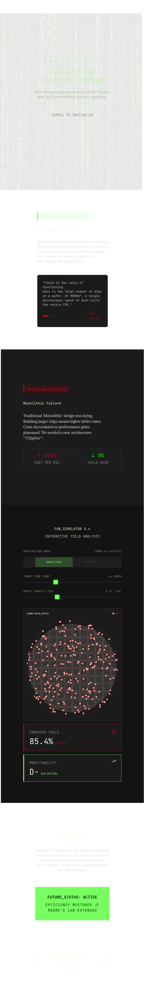

# Virtual Exhibit Proposal: The Chiplet Revolution: How AMD Solved the Cost and Scaling Problem

## GitHub Repository Link
**https://github.com/Kemo1006/CSARCH2**

---

## Group 8 Members
1. Colcol, Massimo
2. Dicreto, Eirnan  
3. Ong, Kyle 
4. Salvador, Miguel 
5. Tanchiao, Manuel

---

## REVISIONS

The following changes have been made from the original proposal:

| Section | Original (Multi-core) | Revised (Chiplet) |
|---------|----------------------|-------------------|
| **Title** | Multi-Core Processors: Solving the Power Wall Problem | The Chiplet Revolution: How AMD Solved the Cost and Scaling Problem |
| **Topic Theme** | Focused on power wall / heat crisis from high clock speeds | Focused on reticle limit + defect cost crisis in semiconductor manufacturing |
| **Problem Statement** | Too much heat, cooling failure | Dies too big, single defect ruins expensive chip, reticle limit (800mm²) |
| **Solution** | Multiple cores sharing workload | Multiple small chiplets connected together |
| **Interactive Element Name** | The Thermal Architecture Simulator | Monolithic vs. Chiplet Cost Simulator |
| **Interactive Focus** | Clock speed vs. core count (temperature) | Monolithic die vs. chiplets (cost, yield, reticle limits) |

---

## Group's Topic Theme

By 2015, the semiconductor industry faced a serious physical and economic barrier. Processor manufacturers had traditionally improved performance by making chips larger, adding more transistors to a single "monolithic" die. However, this approach hit two hard limits: the **reticle limit** (the maximum die size a machine can print, roughly 800mm²) and the **defect problem** (a single tiny imperfection on a large, expensive die would destroy the entire chip). With high-end server processors costing tens of thousands of dollars each, the industry's traditional scaling method was becoming financially unsustainable.

AMD solved this problem in 2017 with the introduction of the **Zen architecture** and its revolutionary **chiplet design**. Instead of building one massive processor die, AMD created smaller, cheaper "chiplets", individual pieces of silicon that perform specific functions and connected them on a single package using high-speed interconnects. This approach meant that if one chiplet had a defect, only that small chiplet was wasted, not the entire processor. Manufacturing yields improved dramatically, and AMD could build processors with more cores than previously possible.

This is a classic **"problem-solving story" for Section S03** because AMD faced a seemingly dead-end problem, how to continue scaling processor performance without bankrupting themselves on manufacturing costs, and solved it through an innovative architectural shift. The chiplet revolution transformed AMD from an underdog to an industry leader, and today, even Intel has adopted chiplet-based designs.

### Sources
1. The Register. (2024). *AMD credits ditching monolithic DC chips for Epyc GHG cuts*. https://www.theregister.com/2024/04/23/amd_chiplets_ghg/
2. Guru3D. (2019). *Tech preview: AMD Ryzen 3000 - 7nm Zen 2*. https://www.guru3d.com/review/tech-preview-amd-ryzen-with-ryzen-3950x/page-3/

---

## Group's Tech Stack Plan

### Proposed Interactive Element

**Name:** Monolithic vs. Chiplet Cost Simulator

**What it does:**  
An interactive dashboard that allows visitors to step into the role of a computer architect at AMD in 2015. The interface challenges users to design a processor by choosing between a traditional monolithic die (a single large chip) and a chiplet-based design (multiple small chiplets connected). It shows the cost, manufacturing yield, and performance of each approach in real time.

**How the user interacts with it:**  
Users click buttons to switch between Monolithic Mode and Chiplet Mode. Sliders control the number of cores, die size, and acceptable defect rate. After clicking "Calculate," the simulator displays:
- Total cost per processor
- Estimated manufacturing yield (percentage of good chips)
- Final "Profitability Rating" (A+ to F)
- A warning if the monolithic design exceeds the 800mm² reticle limit
- A visual wafer map showing defect locations and which chips survive

**Technical implementation:**  
The simulator will be built as a React functional component. A custom function calculates yield using the standard semiconductor formula. The component dynamically renders cost comparisons and conditionally shows warning banners. A Canvas or SVG element will visually represent defects on a wafer.

**How it teaches the topic:**  
Users discover that making a large monolithic die results in high cost and low yield; a single defect ruins the entire expensive chip. With chiplets, defects affect only a single chiplet, keeping costs low. The simulator shows that an 800 mm² monolithic die might yield only 30% good chips, whereas the same wafer using chiplets could yield 90% usable chiplets. This teaches why AMD's chiplet revolution was a breakthrough solution to the manufacturing scaling problem.

---

### Mobile-Responsive Layout

---

### Tentative Style Guide Snapshot

---