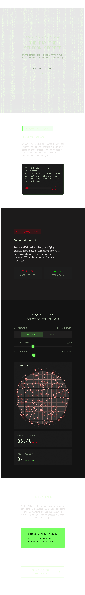

# Virtual Exhibit Proposal: The Chiplet Revolution: How AMD Solved the Cost and Scaling Problem

## Group 8 Members
1. Colcol, Massimo
2. Dicreto, Eirnan  
3. Ong, Kyle 
4. Salvador, Miguel 
5. Tanchiao, Manuel

## Mid-Milestone Development Update
### Deployment Link
**https://csarch2-virtual-exhibit-ten.vercel.app/**

---

### Development Progress
#### What Has Been Done
| Component | Member | Status |
|-----------|--------|--------|
| `PhysicsWall.astro` + `physics.css` | Massimo  | Done |
| `BeforeAfter.astro` + `before.css` | Kyle | Done |
| `ChipSim.jsx` + `interactive.css` | Miguel, Eirnan | Done |
| `Metrics.astro` + `metrics.css` | Manuel | Done |
| Deployment (Vercel) | Kyle | Done |

---

#### Aha Moments or Things Learned
**Colcol, Massimo:**
> While I was trying to learn about the physics wall, one thing I learned is that making one huge chip is very risky because one tiny defect or particle can ruin the entire thing. This means that the bigger the chip is, the higher the risk of failure you can have. Chiplets help solve the problem by breaking one huge chip into smaller parts, since you can only get one chiplet that is defective to the whole chip; other chiplets can still be used, and it can still work. Which is also one of my aha moments that having bigger chips doesn't mean that it's always better.

**Dicreto, Eirnan:**
> Successfully bridging the gap between the theory of the topic and connecting it to the front-end design. Understanding the math and implementing the code to show its visual representation, I gained a deeper understanding of how Astro works and how it handles components of React. 

**Ong, Kyle:**
> I learned what `.astro` files and `.mdx` files are and how similar they are to HTML. Astro components feel like writing standard HTML with the added ability to import and use other components, while MDX lets me write Markdown content with interactive React components embedded inside. It made building the exhibit feel more intuitive since I was already familiar with HTML.

**Salvador, Miguel:**
> Developing the interactive simulator helped me better understand how semiconductor manufacturing concepts can be translated into an educational tool. I learned how React's state management and dynamic rendering can be used to update calculations and visualizations in real time, making abstract concepts like manufacturing yield and defect density easier to explore and understand.

**Tanchiao, Manuel:**
> Developing this project widened my perspective on AMD and the semiconductor industry as a whole, but more importantly, the soft skills, like learning how to work with others despite my own shortcomings, mastering accountability even when your personal life is falling apart, etc.

---

#### Challenges Faced
**Colcol, Massimo:**
> The challenges I faced were that I tried to do an exact copy of our Figma work, but when I tested it on our website, it didn't fit, which made it hard to edit stuff, especially for the css in, which took me a while to figure out how to fit our Figma into a narrowed version of the physics wall. Another challenge was that I had to remove some parts of our Figma from the website, such as the sidebar design, which I had to trace and remove from the code to have a cleaner version of our files.

**Dicreto, Eirnan:**
> Figma-to-code translation was difficult due to manually doing each part of the design. Certain elements were harder to implement in code, and some were modified instead. There were errors on my end regarding running the website due to packages, which led to multiple errors throughout my progress. Resolved it by doing a clean reinstallation

**Ong, Kyle:**
> The challenges I encountered were mostly CSS-related. I had to make sure each section matched the overall dark theme of the museum template while still copying the specific layouts from our Figma drafts. It was tricky getting the colors, spacing, and fonts to look exactly like the design, especially since the museum template had its own global styles that kept overriding my custom CSS. I also had to figure out how to properly scope my styles using class prefixes like `.before-after-section,` so they wouldn't leak into other components or break the existing layout.

**Salvador, Miguel:**
> The main challenge was designing a simulator that was both educational and interactive. I needed to simplify semiconductor yield calculations into a model that users could easily understand while ensuring the React interface remained responsive and the visualizations updated smoothly.

**Tanchiao, Manuel:**
> The challenges I faced were more personal than technical. I struggled with personal issues, which caused me to become unresponsive to the group for a period of time despite repeated attempts to contact me. This led to conflict and panic within our group as the deadline was approaching, and I take responsibility for my shortcomings fully.

---

#### Things To Be Done for Final Submission
- [ ] Complete remaining component content (written exhibit text)
- [ ] Mobile responsiveness testing and cleaning of CSS

---

#### Disclosure on Use of AI / LLM
This project was developed with the assistance of AI tools (ChatGPT) in the following ways:

- **Frontend Development:** Used as an assistive tool during the development of the frontend components — generating and refining HTML/CSS layouts, React/Astro component structures, styling suggestions, and UI improvements.

- **Layout & Responsiveness:** Used to properly layout the Physics Wall container so it fit correctly on the website, fixing issues where it was narrowed down to a smaller size. Also used for correct sizing to ensure better compatibility for mobile users.

- **Metrics Section:** Used as an assistive tool for enhancing the development of the metrics section and its explanation.

- **Interactive Element Logic:** Assisted in the creation of certain elements or designs that were difficult to implement in code. Also used to thoroughly explain the theory behind chiplets and help with the backend math of the interactive element (yield calculations, cost comparisons, etc.).

All content and code have been reviewed, verified, and adapted by the group members.
---

## REVISIONS
The following changes have been made from the original proposal:

| Section | Original (Multi-core) | Revised (Chiplet) |
|---------|----------------------|-------------------|
| **Title** | Multi-Core Processors: Solving the Power Wall Problem | The Chiplet Revolution: How AMD Solved the Cost and Scaling Problem |
| **Topic Theme** | Focused on power wall / heat crisis from high clock speeds | Focused on reticle limit + defect cost crisis in semiconductor manufacturing |
| **Problem Statement** | Too much heat, cooling failure | Dies too big, single defect ruins expensive chip, reticle limit (800mm²) |
| **Solution** | Multiple cores sharing workload | Multiple small chiplets connected together |
| **Interactive Element Name** | The Thermal Architecture Simulator | Monolithic vs. Chiplet Cost Simulator |
| **Interactive Focus** | Clock speed vs. core count (temperature) | Monolithic die vs. chiplets (cost, yield, reticle limits) |

---

## Group's Topic Theme
By 2015, the semiconductor industry faced a serious physical and economic barrier. Processor manufacturers had traditionally improved performance by making chips larger, adding more transistors to a single "monolithic" die. However, this approach hit two hard limits: the **reticle limit** (the maximum die size a machine can print, roughly 800mm²) and the **defect problem** (a single tiny imperfection on a large, expensive die would destroy the entire chip). With high-end server processors costing tens of thousands of dollars each, the industry's traditional scaling method was becoming financially unsustainable.

AMD solved this problem in 2017 with the introduction of the **Zen architecture** and its revolutionary **chiplet design**. Instead of building one massive processor die, AMD created smaller, cheaper "chiplets", individual pieces of silicon that perform specific functions and connected them on a single package using high-speed interconnects. This approach meant that if one chiplet had a defect, only that small chiplet was wasted, not the entire processor. Manufacturing yields improved dramatically, and AMD could build processors with more cores than previously possible.

This is a classic **"problem-solving story" for Section S03** because AMD faced a seemingly dead-end problem, how to continue scaling processor performance without bankrupting themselves on manufacturing costs, and solved it through an innovative architectural shift. The chiplet revolution transformed AMD from an underdog to an industry leader, and today, even Intel has adopted chiplet-based designs.

### Sources
1. Guru3D. (2019). *Tech preview: AMD Ryzen 3000 - 7nm Zen 2 (Page 3)*. https://www.guru3d.com/review/tech-preview-amd-ryzen-with-ryzen-3950x/page-3/

2. The Register. (2024). *AMD credits ditching monolithic DC chips for Epyc GHG cuts*. https://www.theregister.com/2024/04/23/amd_chiplets_ghg/

3. TokenRing AI. (2026). *The Chiplet Revolution: How Heterogeneous Integration is Scaling AI Beyond Monolithic Limits*. Wedbush Investor. https://investor.wedbush.com/wedbush/article/tokenring-2026-1-2-the-chiplet-revolution-how-heterogeneous-integration-is-scaling-ai-beyond-monolithic-limits

4. Broekhuijsen, N. (2021). *AMD Patents Chiplet Design To Build Colossal GPUs*. Tom's Hardware. https://www.tomshardware.com/news/amd-gpu-chiplet-patent

5. OC3D. (2018). *AMD Reveals Transformative "Chiplet" Design for Zen 2 EPYC Processors*. Overclock3D. https://overclock3d.net/news/cpu_mainboard/amd-reveals-transformative-chiplet-design-for-zen-2-epyc-processors/

---

## Group's Tech Stack Plan
### Proposed Interactive Element
**Name:** Monolithic vs. Chiplet Cost Simulator

**What it does:**  
An interactive dashboard that allows visitors to step into the role of a computer architect at AMD in 2015. The interface challenges users to design a processor by choosing between a traditional monolithic die (a single large chip) and a chiplet-based design (multiple small chiplets connected). It shows the cost, manufacturing yield, and performance of each approach in real time.

**How the user interacts with it:**  
Users click buttons to switch between Monolithic Mode and Chiplet Mode. Sliders control the number of cores, die size, and acceptable defect rate. After clicking "Calculate," the simulator displays:
- Total cost per processor
- Estimated manufacturing yield (percentage of good chips)
- Final "Profitability Rating" (A+ to F)
- A warning if the monolithic design exceeds the 800mm² reticle limit
- A visual wafer map showing defect locations and which chips survive

**Technical implementation:**  
The simulator will be built as a React functional component. A custom function calculates yield using the standard semiconductor formula. The component dynamically renders cost comparisons and conditionally shows warning banners. A Canvas or SVG element will visually represent defects on a wafer.

**How it teaches the topic:**  
Users discover that making a large monolithic die results in high cost and low yield; a single defect ruins the entire expensive chip. With chiplets, defects affect only a single chiplet, keeping costs low. The simulator shows that an 800 mm² monolithic die might yield only 30% good chips, whereas the same wafer using chiplets could yield 90% usable chiplets. This teaches why AMD's chiplet revolution was a breakthrough solution to the manufacturing scaling problem.

---

### Mobile-Responsive Layout

---

### Tentative Style Guide Snapshot

---